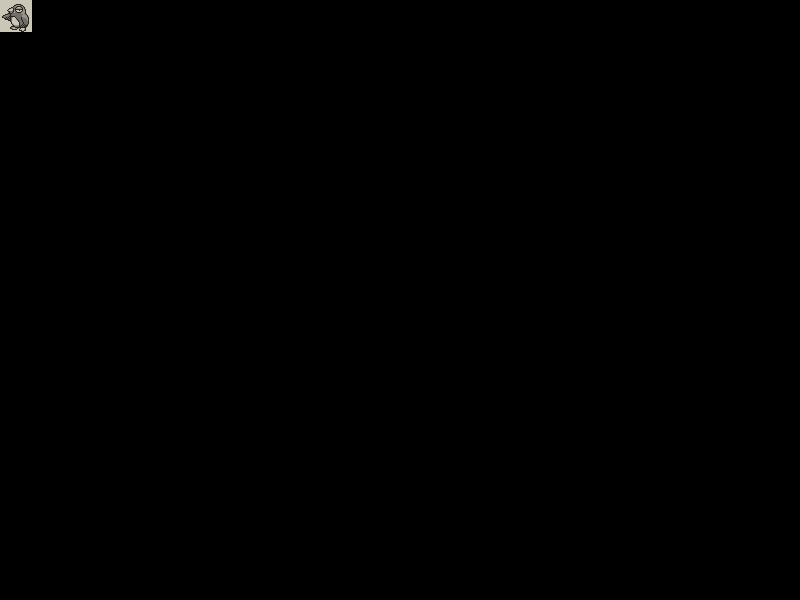

# Part Four: Loading and Displaying Assets
In [part one](../part-one) of the tutorial we talked about the kind of game that we'd be creating, and in [part two](../part-two) we created a new project from a starter project.

In [part three](../part-three) of the tutorial we prepped our assets for use in the game, and this time we'll start actually displaying them.

## Loading Assets
With our individual assets prepped, we can now go about loading them so that we can display them.

With our current structure we have three states that are called:

1. Boot
2. Preloader
3. MainMenu

As we know from the starter project, the Preloader state should be used to preload any assets that might be used by the game.

For now, we won't use the Boot state to preload an asset for a progress bar.

We'll go ahead and open the Preloader state and take a look.

The `preload()` function currently logs to the console, for debugging purposes. It then sets a default path on any calls to the Phaser Loader. Since we've put our assets in the **assets** directory we'll leave this as-is.

	this.load.path = 'assets/';

Finally we have a `create()` function that passes us into the `MainMenu` state. We'll leave this function alone.

While we could do a loop, since we ultimately want to use an atlas with a single image, we'll go ahead and manually load all five images individually.

	this.load.image('enemy0');
	this.load.image('enemy1');
	this.load.image('enemy2');
	this.load.image('enemy3');
	this.load.image('enemy4');

If we build our project (Shift + Command + B) and then refresh our web site we should see in the Network tab of our browser our five images being loaded. But what we really want to do is display our enemies.

## Displaying Assets

While we may eventually want to build out a main menu, we'll leave that for later and create our main game state.

Copy the **_ExampleState.ts** file and rename it to **MainGame.ts**, since `Game` is already used for the project as a whole. Rename all instances of `ExampleState` to `MainGame` within this file.

We'll need to register our new state by going into **Game.ts** and add the following line in the `constructor()` function, below the other related state additions.

	this.state.add('MainGame', MainGame);

Now in the MainMenu state we can have it automatically start our new `MainGame` state, adding the following at the bottom of the `create()` function.

	this.game.state.start('MainGame', true, false);

Back in our `MainGame` we'll go ahead and add an enemy to the page, by adding the following at the bottom of the `create()` function.

	this.game.add.sprite(0, 0, 'enemy0');

Now build our project (Shift + Command + B) and load the site to test. This should display the sprite in the top left corner, albeit relatively small.

> This section is in progress.

## Next Steps
> to be determined

[lucky-enemies]: https://luckycassette.itch.io/lucky-bestiary-gb
[imagemagick]: https://www.imagemagick.org
